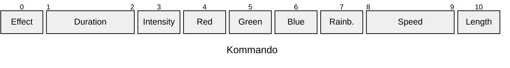

# LED Gwändli der Uzepatscher

Dieses Dokument beschreibt die Techniken, Vorgehensweisen, Komponenten und Schnittstellen der LED-Gwändli der Uzepatscher.

**Ziel**: Auf die Musik passende und untereinander synchronisierte LED-Show.

## Inhalt

[TOC]

# Hardware

Das System umfasst hardwaretechnisch folgende Komponenten:

- 1x ein **"Tablet"** für die Steuerung
- 1x ein **"Hub"** (Raspberry Pi) für Orchestrierung
- 50x ein ESP32 als **"Nanos"** für Befehle in Lichtsignale ummünzen

## Tablet

Das Tablet kann irgend ein Gerät mit einem grösseren Bildschirm sein, dass sich via WLAN mit dem Hub verbindet und dann eine Webseite aufruft. Auf dieser Webseite können dann Befehle ausgespielt werden, welche über eine REST-Schnittstelle beim Hub Aktionen ausgelöst werden können.

- z.B. iPad 4th Generation

## Hub

Der Hub ist ein Raspberry Pi. Auf dem Hub laufen zwei Komponenten:

- Die Python-Software als Service, welche die Signale an die Nanos sendet und orchestriert
- Ein Webserver, welcher die Files für die Talbet-Applikation served.

Wichtig ist, dass der Hub eine gute WLAN-Antenne und eine gute Stromversorgung hat.

- [Raspberry Pi](https://www.digitec.ch/de/s1/product/raspberry-pi-raspberry-pi-5-4gb-entwicklungsboard-kit-38955609) mit WLAN-Antenne (unspezifiziert)
- Leistungsstarke Power-Bank

## Nano

Jeder Gugger trägt und besitzt ein Nano, welches die Singnale vom Hub via WLAN empfängt und dann in entsprechende Signale für den LED-Streifen umwandelt. Zudem natürlich einen LED-Streifen, der beliebig unterbrochen und mit 3 adrigen Lizen verlängert werdne kann. Mit Magnetverbinder ist es möglich, periphere Geräte / Accessoires zu verbinden und diese im Falle eines Unterbruches nicht zu beschädigen.

- 1x ESP32 als günstiger und robuster Mikrocontroller
  - Zur Diskussion könnte auch [dieser Mikrocontroller](https://www.reichelt.de/ch/de/arduino-nano-esp32-ohne-header-esp32-s3-usb-c-ard-nano-esp32-p353107.html?&trstct=pos_2&nbc=1) Stehen
- 1x 1.6m [LED-Streifen](https://www.bastelgarage.ch/5m-ws2812b-30led-m-led-neopixel-strip-rolle?search=WS2812B) (1/3 von 5m Rolle). Bei Bedarf können auch zwei Streifen für "innen" und "aussen" Gwändli in Anspruch genommen werden.
- 1x [Magnet-Verbindung](https://de.aliexpress.com/item/1005006531774076.html) für Hüte, Instrumente, ect.
- 2x Stecker zwischen Nano und LED-Streifen (geliefert von neuem Gugge-Präsident)
- Lizen (am Besten 3 adrig)

## Fragensammlung Hardware

- Können wir Ausrechnen, was 1.6m LED-Streifen + ESP32 mit WIFI pro 20min für Energie verbrauchen?
  - Was müssen wir der Gugge kommunizieren bezüglich Powerbanks?
- Wie sehen die Steckverbindungen bestenfalls aus?

# Software

Hauptkern des Projektes ist die Software, welche möglichst robust und sauber laufen soll.

## Landschaft

Die Software-Landschaft sieht folgendermassen aus:

- **Spezialversion MIDI-Connections**, um auf den Songs in MIDI-Struktur die Lichtshow zu planen und zu testen
- **Tablet: ``vue.js`` Applikation**, um die Songs zu orchestrieren und Kommandos zu geben
- **Hub: ``python`` Applikation/Server**, welche die Signale vom Tablet empfängt und die Sequenz-IDs via TCP/UDP an die Nanos ausspielt. Kann benfalls einen Nano willkommen heissen
  - ``SQLite``-Server für das Echtzeit-Messageing-System, speichern der Sequenzen und überwachen/ansprechen der Nanos
  - ``daemon`` welcher auf den USB-Input hört und die darauf befindende JSON-Datei in die Sequenz-Datenbank einträgt
- **Nano: ``C++`` Applikation**, welche die Sequenz-IDs empfängt und die entsprechende Sequenz mit dem LED-Streifen abspielt

## Show-Elemente

In der Show gibt es folgende Elemente:

**Song**
Ein Song ist ein abgeschlossenes Lied, so wie wir es in der Gugge kennen

**Part**
Ein Song hat mehrere Parts wie Refrain, Strophe, Bridge, ect.

**Effekte**
Einen Effekt besteht aus einer bestimmten Abfolge von LED-Leuchterscheinungen, die in einem bestimmten Interval nacheinander abgespielt werden. Einen Effekt kann ein Fade in-out oder blinken oder einfach steady Licht sein

## Informationshierarchie

Was wissen und orchestrieren die einzelnen Komponenten?

**Tablet**
[Besitzt keine nennenswerten Informationen]

**Hub**
- Zuordnung Nano-ID zu
  - IP-Adresse
  - Gugger
  - Register
  - Farbverlauf
- Alle Songs und deren Parts

**Nano**
- Hat eine fixe ID (mac-adresse)
- Hat eine aufrechte TCP-Verbindung mit HUB

## Requirements & Schnittstellen

Dieser Abschnitt beschreibt, was die Elemente im Detail können müssen inkl. der Schnittstellen

### Hub

- Der Hub hat eine fixe 'masterIP': `192.168.220.1`

#### Hotspot

Der Hub etabliert einen Hotspot, mit welchem sich die Nanos und das Tablet verbinden können. Daten dafür:
- SSID: `uzepatscher_lichtshow`
- Passwort: `NZpqLB2kqg`

#### Datenbank

Die SQLite-Datenbank speichert folgende Infos:

**musicians**
| mac_address     | ip             | uzepatscher | register | color       | position |
| --------------- | -------------- | ----------- | -------- | ----------- | -------- |
| 25:df:we:ep:32: | 192.168.220.24 | Samuel R.   | Drums    | cyan-yellow | T6       |

**songs**
song |  
----------- |
Killing in the Name | 

#### Positionen

Die Gugge kann in folgende Positionen aufgeteilt werden, um die einzelnen Gugger ansprechen zu können:

|     | A   | B   | C   | D   | E   | F   | G   | H   | I   | J   | K   | L   | M   | N   | O   |
| --- | --- | --- | --- | --- | --- | --- | --- | --- | --- | --- | --- | --- | --- | --- | --- |
| 7   |     |     |     |     |     |     |     |     |     |     |     |     |     |     |     |
| 6   |     |     |     |     |     |     |     |     |     |     |     |     |     |     |     |
| 5   |     |     |     |     |     |     |     |     |     |     |     |     |     |     |     |
| 4   |     |     |     |     |     |     |     |     |     |     |     |     |     |     |     |
| 3   |     |     |     |     |     |     |     |     |     |     |     |     |     |     |     |
| 2   |     |     | nik | giz | maz | mic |     |     |     | sam | luk | fab | kar |     |     |
| 1   |     |     |     |     |     |     |     | edi |     |     |     |     |     |     |     |

#### Endpunkte

Der Hub stellt folgende Endpunkte zur Verfügung

**für Nanos**

`GET /nano/register` Nano registriert sich.

**für Tablet**

`GET /tablet/songs` liefert in JSON-Format alle verfügbaren Songs

`POST /tablet/songs/{song_id}` Update Song

`POST /tablet/songs/{song_id}/queue` Song zur Queue hinzufügen

`GET /tablet/queue` liefert in JSON-Format die aktuelle Queue zurück

`DELETE /tablet/queue` Song von Queue entfernen

`POST /tablet/next` Zum nächsten Song-Part tapen (z.B. von Refrain in Strophe -> gem. Kanal 25)

`POST /tablet/command` Manueller Command sofort an alle Nanos senden

...tbd

**generell**

`POST /program/{programm_id}` Programm-ID (z.B. A / B Programm)

...tbd

-> TODO: Menschlicher Input für "in den nächsten Part" tap

### Ablauf

Der Hub gruppiert alle TSN-Events, die gleichzeitig stattfindet. In dieser Reihenfolge werden die Signale bearbetet:

Welcher Effekt in welchen Einstellungen:

- Kommando (Daraus folgen die Settings)
- Settings
- Farben

Anschliessend die Zielgruppe:

- Spezialeffekte
- Register

### Nano

**WIFI (generelle Gedanken)**

Sobald der Nano am Strom ist, sucht er in kurzen Abständen (ca. 2-3s) nach dem WIFI des Hubs in der Umgebung.

Die Suchabstände soll aus Energiespargrünen konstant verlängert werden. Nach
- 20 Versuchen, Abstand auf 20s
- 40 Versuchen, Abstand auf 1m

Bei jedem Loop überprüft der Nano, ob er noch mit dem WiFi verbunden ist und falls nicht, startet er wieder den Suchvorgang.

Der Nano hat eine Mac-Adresse, mit welcher er sich identifiziert (anonym und nicht auf einen Uzepatscher bezogen -> austauschbarkeit)

Sobald mit dem WIFI verbunden, fragt der Nano den Status ab, in welchem die Show im Moment ist.

Während der Show: Kommunikation läuft über TCP. Sprich eine Aktive Verbindung wird aufrecht erhalten.
Rund um Shows: Die Kommunikation läuft über UDP und all 15s fragt der Nano seinen Buffer ab (mit ggf. Kommando).

**Anmeldung**

Sobald das WIFI gefunden wurde oder die Verbindung wieder etabliert ist, passiert eine Anmeldung beim Hub. Damit wird die IP-Adresse (neu) gespeichert und der Nano kann angesprochen werden.

`TCP: masterIP` Mit einem TCP-Kommando wird als Payload die Mac-Adresse übergeben

**Modis**
Wenn der Nano keine WIFI-Verbindung aufbauen konnte, soll er in den Standby-Mode wechseln. Das können z.B. folgende Shows sein:

- Lauflicht im Pingpong in einem der drei UP-definierten Farbbereichen
- Random fade-in-out in zufälligen Farben

Die Leuchtstärke ist bei maximal 10% um möglichst Energie zu sparen.

Wenn sich der Nano mit dem WLAN verbindet, soll er in einen Aktiv-Standby fallen.
Auf das Standby-Kommando soll der Nano in den Standby fallen. Die aktive TCP-Verbindung kann gekappt werden und auf UDP gehört werden.

Es gibt folgende Modis:
- Standby: Sehr energiesparend, all 15s neue Kommandos abfragen, z.B. pulsierender Farbverlauf o.ä.
- Aktiv-Standby: Visuell sichtbar (z.b. 10% weisses Dauerlicht), TCP-Verbindung bereits aufrecht
- Aktiv: Empfängt Pakete mit Informationen zur Show

**Kommandos**

Kommandos sind die byteorientierte Pakete, die per **TCP** von Hub an Nanos gesendet wird.

Ein Kommando ist folgendermassen aufgebaut:

- Effect: Entspricht dem gewählten Effektkanal, 30...39, 100...?
- Duration: Entspricht der Dauer des Effekts in ms, 1...65535. Ist die Duration 0, bleibt der Effekt aktiv, bis er überschrieben wird.
- Intensity: Die Helligkeit des Effekts, 0...255
- Red, Green, Blue: Der RGB Wert, jeweils 0...255
- Rainbow: Statt in einer fixen Farbe kann jeder Effekt auch in Regenbogenfarbe ausgeführt werden, 0...3 (0=aus, 1=Statisch, 2=langsam bewegend, 3=schnell bewegend)
- Speed: Die Geschwindigkeit (Periodizität) des Effekts in ms, wo sinnvoll, 1...65535. Für Effekte ohne Geschwindigkeit wird 0 übertragen
- Length: Die physische Länge des Effekts in LEDs, 1...100. Für Effekte ohne Länge wird 0 übertragen. 

16 bit integers werden in "Network Byte Order" also Big-Endian übertragen. 

Zusätzlich zu den Effekten, die direkt den Midi-Kanälen entsprechen, werden weitere Kommandos ab der Nummer 100 / 0x64 definiert:

| Kommando | Name          | Beschreibung                                                    | Bermerkunen                                   |
| -------- | ------------- | --------------------------------------------------------------- | --------------------------------------------- |
| `0x64`   | Off           | Schaltet den Nano soweit möglich ab, Powercycle nötig           | Alles Werte 0                                 |
| `0x65`   | Standby       | Schaltet den Nano in den Standbymodus                           | Alles Werte 0                                 |
| `0x66`   | Aktiv Standby | Schaltet den Nano in den aktiven Standby                        | RGB kann angegeben werden                     |
| `0x67`   | RGB           | Schaltet alle LEDs auf den angegebenen RGB Wert                 |                                               |
| `0x68`   | Rainbow       | Voll konfigurierbarer Regenbogeneffekt                          | Speed = Zeitperiode Length = "Wellenlänge" |
| `0x69`   | Blink         | Lässt einzelne LEDs in gegebener Periode (1s/Takt) blinken      | Length ist ID der LED                         |
| `0x70`   | Single        | Setzt einzelne LED                                              | Length ist ID der LED                         |
| `0x71`   | Add. Single   | Setzt weitere LED, Kommando davor muss `0x70` oder `0x71` sein. | Length ist ID der LED                         |

### MIDI Format für LED RGB Streifen Steuerung

Edi wird in MIDI Connections ein Interface einbauen, welches es einfach macht, die Lichtshow zu kreieren, zu konstruieren und zu organisieren. Es gibt mehrere Kanäle mit je 128 "Noten". Die Noten haben jeweils zwei Werte: Länge (Duration) und "Velocity" (dieser Wert kann aber unterschiedlich sein). Die verschiedenen Kanäle werden nur gebraucht, wenn sich mehrere Effekte überlagern.

**Register**

Wenn sich das Register matcht, dann werden alle anderen Werte "applied".

| Kanal | Beschriftung       | Beschreibung       | Duration | Velocity | Bemerkungen |
| ----- | ------------------ | ------------------ | -------- | -------- | ----------- |
| 1     | Ganze Gugge        | überschreibt alles | Aktiv    | -        |
| 2     | Drums              |                    | Aktiv    | -        |
| 3     |                    |                    | Aktiv    | -        |
| 4     | Pauken             |                    | Aktiv    | -        |
| 5     | Lira               |                    | Aktiv    | -        |
| 6     | Chinellen          |                    | Aktiv    | -        |
| 7     | 1. Trompete        |                    | Aktiv    | -        |
| 8     | 2. Trompete        |                    | Aktiv    | -        |
| 9     | 1. Posaune         |                    | Aktiv    | -        |
| 10    | 2. Posaune         |                    | Aktiv    | -        |
| 11    | 3. Posaune         |                    | Aktiv    | -        |
| 12    | Bässe              |                    | Aktiv    | -        |
| 13    | Bässe Instrumente  |                    | Aktiv    | -        |
| 14    | Wägeli Instrumente |                    | Aktiv    | -        |
| 15    | Pauken Instrumente |                    | Aktiv    | -        |

**Farben**

| Kanal | Beschriftung | Beschreibung | Duration | Velocity             | Bemerkungen |
| ----- | ------------ | ------------ | -------- | -------------------- | ----------- |
| 18    | R            | Rot          | Dauer    | Lichtstärke 0 - 100% |
| 19    | G            | Grün         | Dauer    | Lichtstärke 0 - 100% |
| 20    | B            | Blau         | Dauer    | Lichtstärke 0 - 100% |

**Einstellungen**

Diese Einstellungen können andere Effekte beeinflussen.

| Kanal | Beschriftung | Beschreibung                      | Duration           | Velocity             | Bemerkungen                            |
| ----- | ------------ | --------------------------------- | ------------------ | -------------------- | -------------------------------------- |
| 26    | Speed        | Geschwindigkeit des Effekts in ms | Gültigkeitsbereich | Speed in ms          |
| 27    | Länge        | Länge des Effekts in Pixel        | Gültigkeitsbereich | Anzahl LED 0 - 100   |
| 28    | Lichtstärke  | Intensität des Lichts             | Gültigkeitsbereich | Lichtstärke 0 - 100% | überschreibt alle anderen Lichtstärken |

**Effekte**

Wenn kein Effekt angewählt ist, strahlen die LEDs einfach die gewählte Farbe. Effekte sind nicht mischbar, es wird der erste Kanal genommen, welcher verfügbar ist

| Kanal | Beschriftung           | Beschreibung                                    | Bemerkungen                                              | Parameter                                 |
| ----- | ---------------------- | ----------------------------------------------- | -------------------------------------------------------- | ----------------------------------------- |
| 30    | Lauflicht              | Tatzelwurm an LED-Leuchten                      | Speed (50 zügig)                                         | length: Anzahl der LEDs                   |
| 31    | Glitzern               | Zufälliges Blinken aller LED                    | Speed (10 langsam, 2 schnelles glizern)                  | length: Wahrscheinlichkeit des Blinken    |
| 32    | Lauflicht alternierend | Tatzelwurm, aber jedes zweite LED weiss         | Speed (50 zügig)                                         | length: Anzahl der LEDs                   |
| 33    | Pulsieren              | LED pulsiert an/aus                             | Speed (5 schnell, 50 pulsieren, 100 langsam)             | length: "tiefe" des Pulsierens -> 0 = 40% |
| 34    | Starlight Drift        | langsamer effekt, zufällige Sterne leuchten auf |                                                          |
| 35    | Strobo                 | Stroboskop-Effekt                               | Speed  (50 schnell, 120 langsam)                         |
| 36    | Regenbogen             | Regenbogen-Effekt                               | Speed   (10 normale geschwindigkeit)                     |
| 37    | Pulsierende Ripples    | "blob" macht spur und driftet umher             | Speed (1 zügig)                                          |
| 38    | Meteor                 | Lichtkugeln ziehen über die LEDs                | Speed (100 normal, 50 schnell), length (Anzahl der LEDs) |
| 39    | Flackern               | LEDs flackern wie Kerzenlicht, zufällig         | Speed 100 wirkt                                          |
| 40    | Komet                  | ein Komet driftet über alle LEDs                | Speed (10 schnell)                                       |
| 41    | Doppler Effekt         | LED-Element geht hin und her                    | Speed 10 wirkt,                                          | length: Länge des Doppler-Effekts         |
| 42    | Feuerwerk              | Explosion und rot-blauer glitzer                | Speed 20, length 5                                       |
| 43    | DNA-Helix              | DNA Effekt                                      | Speed 10, length (Anzahl der LEDs)                       |
| 44    | DNA-Helix mit Weiss    | DNA Effekt mit Farbe und weiss                  | Speed 10, length (Anzahl der LEDs)                       |
| 45    | leer                   | leer                                            |
| 46    | leer                   | leer                                            |
| 47    | leer                   | leer                                            |

**Guggen-Übergreifende Effekte**

| Kanal | Beschriftung          | Beschreibung                                                | Bemerkungen                               |
| ----- | --------------------- | ----------------------------------------------------------- | ----------------------------------------- |
| 50    | Random                | Zufällige(r) Gugger Leuchten mit gewähltem Effekt           | Länge (wie viele) -> nur all 500ms senden |
| 51    | Wellenüberlauf        | Wellenbewegung von links nach rechts in optimaler Formation | Speed  (30 guter Effekt)                  |
| 52    | Asynchrones Pulsieren | Alle Gugger pulsieren asynchron                             | Speed                                     |
| 53    | Farbexplosion         | Zufällige Farbe bei allen Guggern gleichzeitig              | -                                         |

**Systemsteuerung**

| Kanal | Name            | Beschreibung                                                  | Bermerkunen               |
| ----- | --------------- | ------------------------------------------------------------- | ------------------------- |
| 100   | Off             | Schaltet den Nano soweit möglich ab, Powercycle nötig         | Alles Werte 0             |
| 101   | Standby         | Schaltet den Nano in den Standbymodus                         | Alles Werte 0             |
| 102   | Aktiv Standby   | Schaltet den Nano in den aktiven Standby                      | RGB kann angegeben werden |
| 103   | RGB             | Schaltet alle LEDs auf den angegebenen RGB Wert               |                           |
| 105   | Blink           | Lässt einzelne LEDs in gegebener Periode (1s/Takt) blinken    | Length ist ID der LED     |
| 106   | Single          | Setzt einzelne LED                                            | Length ist ID der LED     |
| 107   | Add. Single     | Setzt weitere LED, Kommando davor muss `106` oder `107` sein. | Length ist ID der LED     |
| 108   | Setze LED Count | Setzt die Anzahl der LEDs                                     | Length ist LED länge      |
| 109   | Setze Farbe     | Setzt die Farbe der LEDs                                      | RGB kann angegeben werden |

## Beispiel-Effekte

Dies sind ein paar Lichteffekte, wie sie möglich wären:

- Rotes Pulsieren (50%), ganze Gugge `[0x21, 0x00, 0x00, 0x7F, 0xFF, 0x00, 0x00, 0x00, 0x03, 0xE8, 0x00]` /  `[33, 0, 0, 127, 255, 0, 0, 0, 3, 232, 0]`
  - Channel 1, velocity > 1 (Ganze Gugge)
  - Channel 18, velocity 100 (Rot, 100%, `0xFF`)
  - Channel 26: velocity 1000 (1000ms / 1s Schneller Speed,  `0x03E8`)
  - Channel 33: velocity 50 (50% Lichtstärke, `0x7F`)
- Oranger Tatzelwurm bei Pauken `[0x1E, 0x00, 0x00, 0xB3, 0xFF, 0xA3, 0x00, 0x00, 0x09, 0xC4, 0x05]` /  `[30, 0, 0, 179, 255, 163, 0, 0, 9, 196, 5]`
  - Channel 4, velocity > 1 (Pauken)
  - Channel 16, velocity 100 (Rot, 100%, `0xFF`)
  - Channel 17, velocity 64 (Grün, 64%, `0xA3`)
  - Channel 25, velocity 2500 (Geschwindigkeit in 2500ms / 2.5s, `0x09C4`)
  - Channel 26, velocity 5 (Länge: 5 LED lang, `0x05`)
  - Channel 30, velocity 70 (Tatzelwurm in 70% Lichtstärke, `0xB3`)
- Zufälliger Gugger:in in weisser Vollbeleuchtung `[0x67, 0x00, 0x00, 0xFF, 0xFF, 0xFF, 0xFF, 0x00, 0x00, 0x00, 0x00]` /  `[103, 0, 0, 255, 255, 255, 255, 0, 0, 0, 0]`
  - Channel 16, velocity 100 (100% Rot, `0xFF`)
  - Channel 17, velocity 100 (100% Grün, `0xFF`)
  - Channel 18, velocity 100 (100% Blau, `0xFF`)
  - Channel 27, velocity 1 (1 zufälliger Gugger)
  - Channel 50, veloctiy 100 (zufälliger Gugger in 100% Leuchtstärke, `0xFF`)

# Infos an Gugge

Um uns schon mal vorzubereiten und zu sammeln, was wir alles bezüglich der technischen Seite der Gugge mitteilen müsse.

- ESP-32 soll möglichst Feuchtigkeitsresistet eingepackt werden (z.b. Plastiksäckli), aber nicht mehrschichtig wegen WLAN.
- Jeder Gugger bekommt 1.6m LED-Streifen. Dieser kann überall getrennt und mit Drähte irgendwo weiter verbunden werden. Wer will, darf für "innen" und "aussen" einen zweiten Streifen beanspruchen, es soll aber immer nur einer aufs Mal leuchten
- Es kann im Streifen eine Magnet-Verbindung eingebaut werden, welche z.B. zu einem Hut oder Instrument geht (und so einfach getrennt werden kann)
- Powerbank-Grösse (siehe Frage oben)
