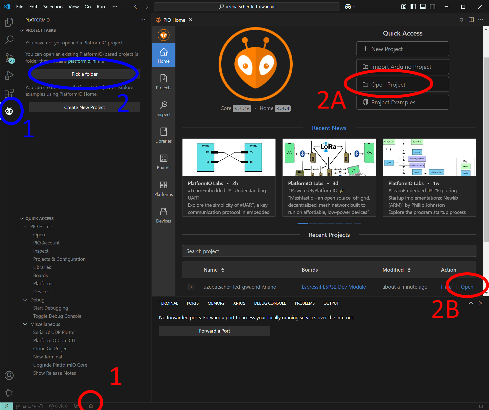
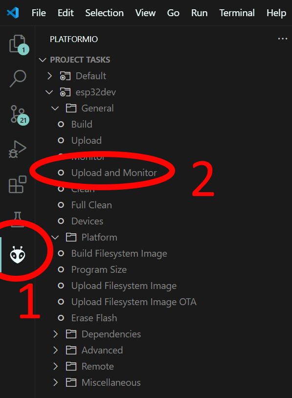
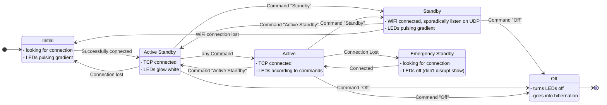

# Nano

## Development Environment

This project uses the PlatformIO IDE extension for VS Code. If you do not have it, install [VS Code](https://code.visualstudio.com/download), and install the extension [PlatformIO IDE](https://marketplace.visualstudio.com/items?itemName=platformio.platformio-ide). The installation may take a while.

Once the extension is installed (including a restart of VS Code), the project can be opened in the following ways:

The project can be compiled and uploaded to the Nano like this:

This automatically compiles and uploads the code, then opens a terminal to see the output of the Nano. The correct COM port should automatically be selected (if the Nano is connected), but can be configured in `platformio.ini`.

### Naming and Styleguide

This project tries to follow the [Google c++ Styleguide](https://google.github.io/styleguide/cppguide.html) where possible. This results in the following naming conventions:

| Type                       | Casing                     | Example                 |
| -------------------------- | -------------------------- | ----------------------- |
| File names                 | snake_case                 | `active_standby.cpp`    |
| Type names                 | PascalCase                 | `LedHandler`            |
| Function names             | PascalCase                 | `HandleActiveStandby`   |
| Constants & Enum entries   | camelCase, with prefix `k` | (e.g. `kActiveStandby`) |
| local and member variables | snake_case                 | `current_state`         |

## State Machine

The Nano operates on this state machine. This corresponds more or less to the states described in the [main readme](../README.md).

The states `Init` and `Active Standby` are very similar. Both put the LEDs on a low intensity pulsing gradient. The main difference is, that in `Init` the Nano actively searches for a connection to the WiFi and the Hub, while in the `Active Standby` a connection to the WiFi exists, but no TCP connection to the Hub is needed.

## Hub

Raspberry Pi running the Hub software.

### SSH

Host: `hub.local`
Username: `uzi`
Password: `nanohub`

### WiFi

SSID: `uzepatscher_lichtshow`
Password: `kWalkingLight`

### Cloud Gateway Ultra

SSID: `Cloud Gateway Ultra`
Password: `UPonTour3000!`
